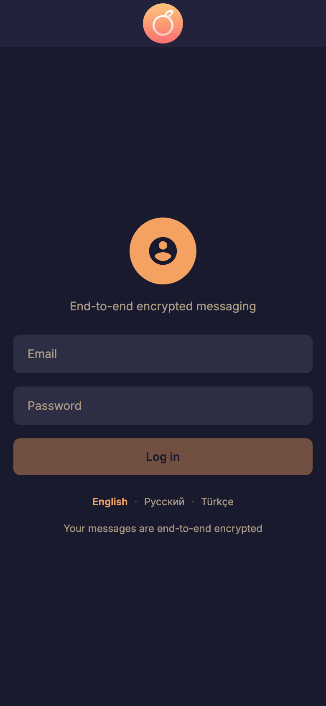
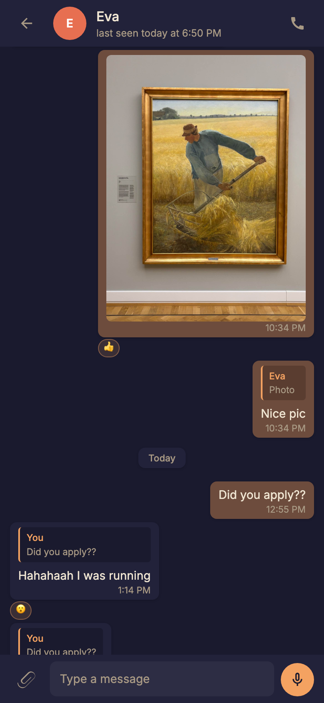
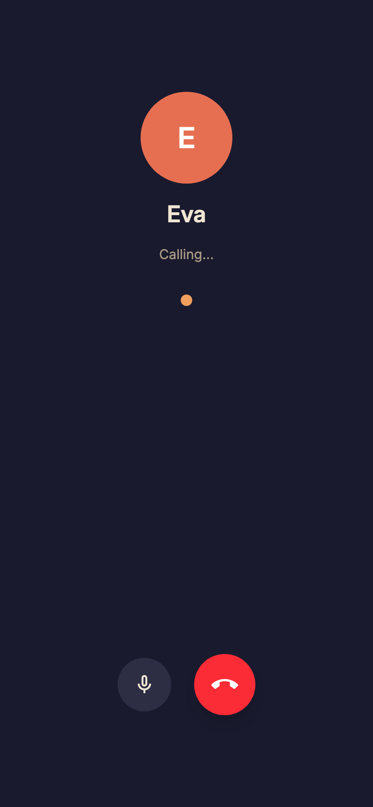
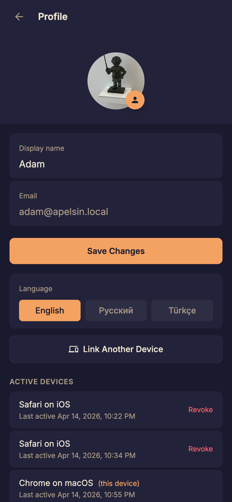

 

# Apelsin

**End-to-end encrypted messaging that runs on infrastructure you actually own.**

Apelsin is a self-hostable, WhatsApp-style messaging PWA. Text, voice messages, images, voice calls, reactions, replies, push notifications, multi-device — all encrypted end-to-end, all running on your own AWS + Cloudflare account. Built on a fully **serverless** stack with no idle costs: a personal deployment typically runs **under $0.10/month**, often free. The entire codebase is a few thousand lines of TypeScript you can read in a weekend and fork the same day.

## Screenshots

| Login | Chats | Conversation |
|---|---|---|
|  |  |  |

| Voice call | Profile |
|---|---|
|  |  |

## Features

- **Messaging** — E2E encrypted text, images, and voice messages. Replies, emoji reactions, day separators, unread markers, paginated history.
- **Real-time** — WebSocket presence (online, typing, recording), live message delivery, targeted broadcasts (no scan-all).
- **Voice calls** — WebRTC P2P audio, signaling over the same authenticated WebSocket, ring timeout, mute controls.
- **Multi-device** — Add a new device by scanning a QR code from an existing one. Private keys never touch the server.
- **Push notifications** — Standard VAPID web push. The service worker decrypts messages locally before showing them.
- **PWA** — Installable, offline-capable, cached messages in IndexedDB, app badge via `navigator.setAppBadge()`.
- **i18n** — English and Russian, auto-detected from the browser.

## Opinionated, not locked in

This repo defaults to **AWS + Cloudflare** because serverless + edge is cheap at idle and scales automatically — the right shape for a messenger that might have one user or a thousand. But the pieces are loosely coupled, and migrating any of them is a bounded exercise:

| Piece | Default | Migrate to |
|---|---|---|
| Compute | AWS Lambda (Node 24) | Cloud Run, Fly.io, a bare Node process — the handlers are plain functions |
| Database | DynamoDB | Any KV-ish store. Schema is intentionally flat, access patterns are fixed |
| Object storage | S3 + presigned URLs | R2, GCS, MinIO — anything that signs PUT/GET URLs |
| HTTP routing | API Gateway | Any HTTP router (Hono, Fastify, nginx) |
| CDN / reverse proxy | Cloudflare Workers (api + media) | Any proxy with caching (Fastly, Bunny, nginx + Varnish) |
| Frontend hosting | Cloudflare Workers SSR | Any Node host — the frontend is just Vite + React Router 7 |
| Push | `web-push` (VAPID) | No migration needed — VAPID is a standard |
| WebSocket | API Gateway WebSocket | Any WebSocket server (uWebSockets, ws) |

There is no AWS-specific or Cloudflare-specific magic in the crypto, the data model, or the client. The infra choices are defaults, not a cage.

## What it costs to run

One of the goals of this project is to stay cheap. The stack is 100% serverless — no EC2, no RDS, no always-on containers — so you pay only for what you actually use. At idle, the bill is effectively zero.

Rough estimates for a personal or small-group deployment:

| Component | Cost |
|---|---|
| Cloudflare Workers (3 workers) | **$0** on the free tier (100k req/day), **$5/mo** on Workers Paid if you exceed it |
| AWS Lambda | **$0** — free tier covers it comfortably |
| DynamoDB (on-demand) | **cents/month** at small scale; messages auto-expire after 7 days |
| S3 (media) | **cents/month** — a few GB of photos and voice notes |
| API Gateway (HTTP + Media + WebSocket) | **$0–$1/mo** — 1M req/month free for the first year, then $1 per million |
| Domain | ~**$1/mo** (annualized) |

**Typical total: under $5/month for a family or small team. Often $0 if you stay in the free tiers.**

The [cost guardrails](aws/cdk/README.md#cost-guardrails) (API Gateway throttling + Lambda reserved concurrency) bound the worst-case bill even under sustained abuse — you can't get surprise-billed into the thousands.

## Architecture at a glance

```
Browser (React PWA)
  │
  ├─ HTTPS ──▶  Cloudflare Worker (apelsin-api) ──▶  AWS HTTP API Gateway ──▶  Lambdas ──▶  DynamoDB / S3
  │
  ├─ HTTPS ──▶  Cloudflare Worker (apelsin-media, cached) ──▶  AWS Media API Gateway ──▶  Lambda ──▶  S3
  │
  └─ WSS  ───▶  AWS WebSocket API Gateway ──▶  Lambdas ──▶  DynamoDB
```

Full details in [CLAUDE.md](CLAUDE.md).

## Design decisions (and their tradeoffs)

Every interesting system is a pile of tradeoffs. Here's what we picked and what we gave up.

### ECDH P-256 + AES-256-GCM, keys in IndexedDB
One long-term keypair per user. For each chat-pair, we derive a shared AES key once via ECDH and reuse it for every message in that chat.

- **Why:** simple, fast, fully implementable with the Web Crypto API. Keys live in IndexedDB so both the main thread and the service worker (for push decryption) can reach them.
- **Tradeoff:** **no forward secrecy.** If your private key is ever exfiltrated, every past and future message in every chat is compromised. Signal's Double Ratchet solves this but is an order of magnitude more complex. A Double Ratchet implementation is on the table for the future — until then, this is honest, simple crypto, not state-of-the-art crypto. If you need Signal's guarantees, use Signal.

### QR-based multi-device key transfer
New devices get the user's private key by scanning a QR code from an existing device, transferred through a short-lived ephemeral ECDH channel on the server.

- **Why:** the server never sees the key, plaintext or otherwise. No password-derived server-side key escrow, no recovery questions.
- **Tradeoff:** if you lose all your devices, your message history is gone. Same model as hardware wallets.

### Per-device tokens with triple-header auth
Every authenticated request sends `Authorization: Bearer <deviceToken>`, `X-Device-Id`, and `X-User-Email`. All three must match a record in DynamoDB.

- **Why:** individual devices can be revoked from the profile page. A stolen token alone isn't enough; the attacker also needs the matching device ID and email, all of which have to agree with server state.
- **Tradeoff:** more request bytes than a single JWT. For a chat app that's noise.

### DynamoDB with a compound `[chatId, timestamp]` sort key
Messages are keyed by `chatId` (partition) and `timestamp#uuid` (sort), giving O(1) cursor-based pagination regardless of chat size.

- **Why:** no schema migrations, no connection pool, pay-per-request pricing, scales to nothing and to millions without thinking about it.
- **Tradeoff:** no ad-hoc queries, no joins. Every access pattern has to be designed into the key/GSI layout up front. For a chat app the access patterns are small and fixed, so this is fine.

### Two API Gateways (main + media)
Media serving runs on its own HTTP API with its own Lambda, separate from the main API.

- **Why:** media requests have very different traffic shapes (large responses, cached aggressively at the edge). Isolating them means a media traffic spike can't starve the control plane, and they can be throttled and scaled independently.
- **Tradeoff:** one more stack output to wire up.

### Origin secret between Cloudflare and AWS
The CF Workers inject a shared `X-Origin-Secret` header on every request to AWS. Lambdas reject requests without it.

- **Why:** the AWS API Gateway URLs would otherwise be publicly reachable. This makes "hit the Lambda directly, bypass the worker" impossible, and costs $0.
- **Tradeoff:** rotating the secret requires coordinated deploys on both sides (see [aws/cdk/README.md](aws/cdk/README.md)).

### Cost guardrails (API Gateway throttling + Lambda reserved concurrency)
Every API has a burst + sustained rate limit. Every Lambda has reserved concurrency capped at 20.

- **Why:** bounds the worst-case monthly bill to a small, predictable number even under sustained abuse. $0 to configure.
- **Tradeoff:** the caps are account-wide, not per-IP. A single abusive user can still trip them. For a personal or small-team deployment, that's the right tradeoff; for large-scale use you'd want WAF rate limits on top.

### Single-route SPA with `pushState`
All paths hit one route. Views (`chats`, `conversation`, `profile`, etc.) are switched in-memory; the URL is kept in sync via `window.history.pushState`.

- **Why:** mobile-app-style transitions, no route-level re-mounts, no data re-fetches on navigation, gesture-driven swipe-to-dismiss works naturally.
- **Tradeoff:** we lose some of React Router's nice ergonomics. The views are simple enough that we don't miss them.

## What Apelsin is not

Apelsin is **not a Signal alternative.** Signal has forward secrecy, post-compromise security, post-quantum key agreement, sealed sender, native clients, and a foundation's worth of cryptographic review. Apelsin has none of those.

Apelsin is for people who want to run their own messenger on infrastructure they control, with simple-enough crypto and a codebase small enough to audit by hand. If you need maximum-security messaging hosted by a foundation you trust, use Signal.

## Quick start

You will need:

- Node.js 24+, pnpm
- AWS account with the CLI configured
- Cloudflare account with Wrangler (`npm i -g wrangler`)
- A domain managed in Cloudflare DNS

Rough sequence:

1. Generate VAPID keys: `npx web-push generate-vapid-keys`
2. Deploy AWS infrastructure — see [aws/cdk/README.md](aws/cdk/README.md)
3. Deploy the three Cloudflare Workers — see [cloudflare/apelsin-api/README.md](cloudflare/apelsin-api/README.md), [cloudflare/apelsin-media/README.md](cloudflare/apelsin-media/README.md), [cloudflare/apelsin-fe/README.md](cloudflare/apelsin-fe/README.md)
4. Point your domain at the workers in Cloudflare DNS
5. Open the frontend URL — register and you're in

For fully automated deploys via GitHub Actions, see [.github/workflows/README.md](.github/workflows/README.md).

## Documentation

- [CLAUDE.md](CLAUDE.md) — full architecture reference (tables, Lambda routes, hooks, libraries)
- [aws/cdk/README.md](aws/cdk/README.md) — CDK stack deployment, DNS, cost guardrails, secret rotation
- [cloudflare/apelsin-fe/README.md](cloudflare/apelsin-fe/README.md) — frontend build & deploy, local dev
- [cloudflare/apelsin-api/README.md](cloudflare/apelsin-api/README.md) — API proxy worker
- [cloudflare/apelsin-media/README.md](cloudflare/apelsin-media/README.md) — media proxy worker with edge caching
- [.github/workflows/README.md](.github/workflows/README.md) — CI/CD secrets and variables

## License

Apelsin is licensed under **AGPL-3.0**. In short: you can use, modify, and redistribute it freely, but if you run a modified version as a network service, you must publish your modifications under the same license. See [LICENSE](LICENSE) for the full text.
